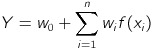
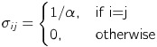
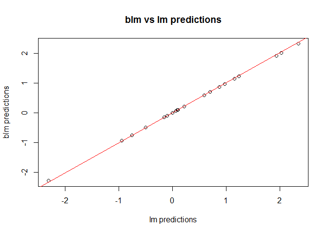
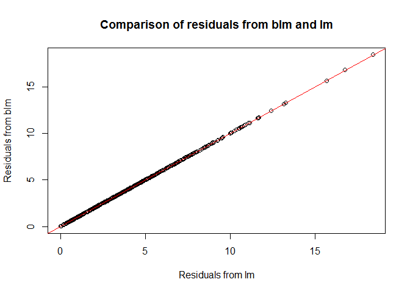

Bayesian Linear Regresssion
---------------------------

This packages was built for the class "Datascience II - Software Development and Testing" at Aarhus University, January 2017. It implements methods to construct ´blm´ objects, calculating posterior distributions and predicting responses from data.

The definition of a linear model is any model that takes on the form



for random variables *x*<sub>*i*</sub> ∈ \[1; *n*\] where *w*<sub>*i*</sub> respresents the weight associated with the term *f*(*x*<sub>*i*</sub>). In general, the function *f*(*x*<sub>*i*</sub>) can be any function, but this package only deals with cases where *f*(*x*<sub>*i*</sub>) is a linear function. It is also assumed that the data is normally distributed.

The linear model must be built using a training dataset that contains one or more explanatory variables and a response variable. The `blm` constructor requires a prior distribution of weights (i.e. their mean and their variance). This can be any distribution, but the `blm` package provides a function `make_prior` that can construct this for you, based on a given prior precision, *α*. This will output a covariance matrix of the form



and a mean of 0 for all *w*<sub>*i*</sub>.

Given a model, a prior distribution, a posterior precision *β*, and some data, `blm` then calculates a posterior distribution of the weights. This is a normal distribution with *w*<sub>*i*</sub> ∼ *N*(*m*<sub>*x*, *y*</sub>, *σ*<sub>*x*, *y*</sub>) where

**m**<sub>*x*, *y*</sub> = *β* **S**<sub>*x*, *y*</sub>*ϕ*<sub>*X*</sub><sup>*T*</sup>**y**,

*σ*<sub>*x*, *y*</sub><sup>−1</sup> = *α**I* + *β* *ϕ*<sub>*X*</sub><sup>*T*</sup>*ϕ*<sub>*X*</sub>

*ϕ*<sub>*X*</sub> is the model matrix where the first column has 1 in every row and each explanatory variable has it's own column. Below is shown the results for a simulated data set.

``` r
#Simulate training data:
set.seed(1)
beta = 0.2; alpha = 1
w0 = 0.2; w1 = 1.2; w2 = 0.5
d = data.frame(x=rnorm(500), z=rnorm(500))
d$y = rnorm(500, w0+w1*d$x+w2*d$z, 1/beta)
head(d)
```

    ##            x           z         y
    ## 1 -0.6264538  0.07730312  5.161732
    ## 2  0.1836433 -0.29686864  5.831597
    ## 3 -0.8356286 -1.18324224 -5.748264
    ## 4  1.5952808  0.01129269  3.173641
    ## 5  0.3295078  0.99160104  1.438188
    ## 6 -0.8204684  1.59396745 -8.300823

``` r
#The model:
m = y ~ x+z

#The prior:
myPrior = make_prior(m, alpha)

#The bayesian linear model:
myBlm = blm(m, myPrior, beta, d)

#Predictions based on the training data:
myFit = fitted(myBlm)
head(myFit)
```

    ##   Prediction Variance
    ## 1 -0.4668516 5.014061
    ## 2  0.3224520 5.010685
    ## 3 -0.8395751 5.029308
    ## 4  1.8173631 5.034010
    ## 5  0.6333261 5.020629
    ## 6 -0.4782695 5.039665

``` r
summary(myBlm)
```

    ## 
    ## Call:
    ## blm(m, myPrior, beta, d)
    ## 
    ## Coefficients:
    ## Weights (with 95% confidence interval):
    ##               Weights     0.025     0.975
    ## (Intercept) 0.1699146 0.1504649 0.1893643
    ## x           1.0318202 1.0127957 1.0508447
    ## z           0.1244641 0.1070236 0.1419046
    ## 
    ## Sigma:
    ##               (Intercept)             x            z
    ## (Intercept)  0.0099235049 -0.0002003487 0.0003962351
    ## x           -0.0002003487  0.0097065376 0.0003796992
    ## z            0.0003962351  0.0003796992 0.0088983917
    ## 
    ## Residuals:
    ## -5.628584 -5.509145 4.908689 -1.356278 -0.804862 7.822553 -3.650759 9.50121 5.671441 -4.551067 ...
    ## (Showing first 10 residuals)
    ## 
    ## Deviance:
    ## [1] 12628.61

``` r
plot(myBlm)
```


Now, we can use the bayesian linear model to predict the response for new data:

``` r
#New data:
set.seed(2)
d2 = data.frame(x=rnorm(20), z=rnorm(20))
d2
```

    ##              x            z
    ## 1  -0.89691455  2.090819205
    ## 2   0.18484918 -1.199925820
    ## 3   1.58784533  1.589638200
    ## 4  -1.13037567  1.954651642
    ## 5  -0.08025176  0.004937777
    ## 6   0.13242028 -2.451706388
    ## 7   0.70795473  0.477237303
    ## 8  -0.23969802 -0.596558169
    ## 9   1.98447394  0.792203270
    ## 10 -0.13878701  0.289636710
    ## 11  0.41765075  0.738938604
    ## 12  0.98175278  0.318960401
    ## 13 -0.39269536  1.076164354
    ## 14 -1.03966898 -0.284157720
    ## 15  1.78222896 -0.776675274
    ## 16 -2.31106908 -0.595660499
    ## 17  0.87860458 -1.725979779
    ## 18  0.03580672 -0.902584480
    ## 19  1.01282869 -0.559061915
    ## 20  0.43226515 -0.246512567

``` r
#Predict response variables for new data using the blm:
myPredict = predict(myBlm, d2)
```

    ## Predicting response variable based on newdata:

We can compare these results with a regular linear model (using `lm` from package `stats`):

``` r
#Creating a linear model:
linReg = lm(m,d)
#Predicting the repsonse using linear model:
linRegPredict = predict(linReg, d2)
plot(linReg, which=c(1,2))
```


``` r
#Comparing blm vs lm predictions:
blmVSlm = lm(linRegPredict ~ myPredict$Prediction)
summary(blmVSlm)
```

    ## 
    ## Call:
    ## lm(formula = linRegPredict ~ myPredict$Prediction)
    ## 
    ## Residuals:
    ##        Min         1Q     Median         3Q        Max 
    ## -0.0008829 -0.0002448 -0.0000326  0.0002484  0.0007800 
    ## 
    ## Coefficients:
    ##                        Estimate Std. Error   t value Pr(>|t|)    
    ## (Intercept)          -1.336e-04  1.043e-04    -1.281    0.217    
    ## myPredict$Prediction  1.010e+00  9.259e-05 10906.395   <2e-16 ***
    ## ---
    ## Signif. codes:  0 '***' 0.001 '**' 0.01 '*' 0.05 '.' 0.1 ' ' 1
    ## 
    ## Residual standard error: 0.0004402 on 18 degrees of freedom
    ## Multiple R-squared:      1,  Adjusted R-squared:      1 
    ## F-statistic: 1.189e+08 on 1 and 18 DF,  p-value: < 2.2e-16

``` r
plot(linRegPredict, myPredict$Prediction, main="blm vs lm predictions", xlab="lm predictions", ylab="blm predictions")
abline(a=blmVSlm$coefficients[1], b=blmVSlm$coefficients[2], col="red")
```



``` r
#compare residuals:
blmRes = residuals(myBlm)
lmRes = linReg$residuals

resCompare = lm(abs(lmRes) ~ abs(blmRes[,1]))
summary(resCompare)
```

    ## 
    ## Call:
    ## lm(formula = abs(lmRes) ~ abs(blmRes[, 1]))
    ## 
    ## Residuals:
    ##       Min        1Q    Median        3Q       Max 
    ## -0.040285 -0.007424  0.000134  0.006555  0.030624 
    ## 
    ## Coefficients:
    ##                   Estimate Std. Error  t value Pr(>|t|)    
    ## (Intercept)      2.647e-05  7.835e-04    0.034    0.973    
    ## abs(blmRes[, 1]) 1.000e+00  1.559e-04 6414.271   <2e-16 ***
    ## ---
    ## Signif. codes:  0 '***' 0.001 '**' 0.01 '*' 0.05 '.' 0.1 ' ' 1
    ## 
    ## Residual standard error: 0.01047 on 498 degrees of freedom
    ## Multiple R-squared:      1,  Adjusted R-squared:      1 
    ## F-statistic: 4.114e+07 on 1 and 498 DF,  p-value: < 2.2e-16

``` r
#Plotting the absolute residuals:
plot(abs(lmRes), abs(blmRes[,1]), main="Comparison of residuals from blm and lm", xlab="Residuals from lm", ylab="Residuals from blm")
abline(a=resCompare$coefficients[1], resCompare$coefficients[2], col="red")
```



This shows that the two types of linear regressions are highly correlated (with a slope very close to 1 and and intercept not significantly different from 0) for a data set of this size.
