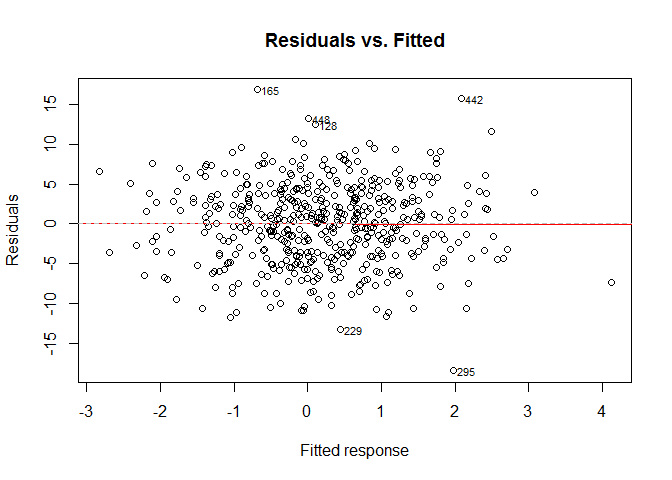
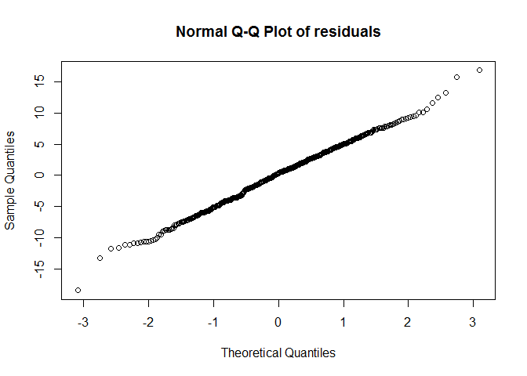
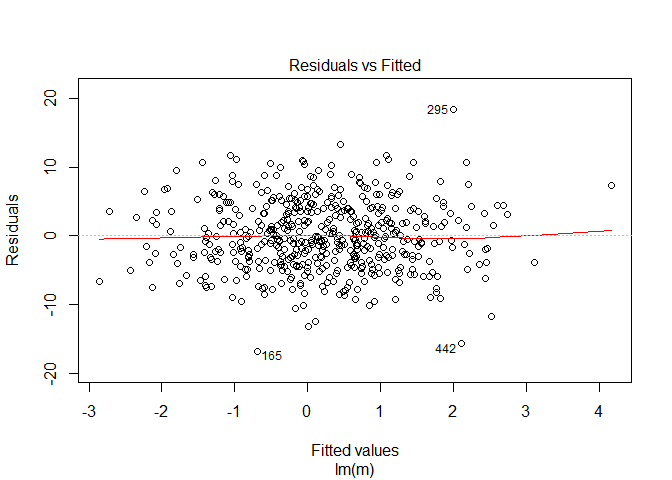
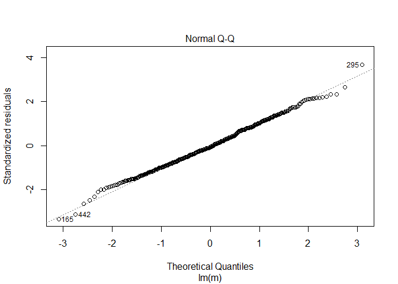

Bayesian Linear Regresssion
---------------------------

This packages was built for the class "Datascience II - Software Development and Testing" at Aarhus University, January 2017. It implements methods to construct ´blm´ objects, calculating posterior distributions and predicting responses from data.

The definition of a linear model is any model that takes on the form

$$
Y = w\_0 +\\sum\_{i=1}^n w\_i\\cdot f(x\_i), 
$$

for random variables *x*<sub>*i*</sub> ∈ \[1; *n*\] where *w*<sub>*i*</sub> respresents the weight associated with the term *f*(*x*<sub>*i*</sub>). In general, the function *f*(*x*<sub>*i*</sub>) can be any function, but this package only deals with cases where *f*(*x*<sub>*i*</sub>) is a linear function.

The linear model must be built using a training dataset that contains one or more explanatory variables and a response variable. The `blm` constructor requires a prior distribution of weights (i.e. their mean and their variance). This can be any distribution, but the `blm` package provides a function `make_prior` that can construct this for you, based on a given prior precision, *α*. This will output a covariance matrix of the form

$$
\\sigma\_{ij} = \\begin{cases} 1/\\alpha,&\\text{if i=j}\\\\0&\\text{otherwise}\\end{cases}
$$

and a mean of 0 for all *w*<sub>*i*</sub>.

Given a model, a prior distribution, a posterior precision *β*, and some data, `blm` then calculates a posterior distribution of the weights. This is a normal distribution with *w*<sub>*i*</sub> ∼ *N*(*m*<sub>*x*, *y*</sub>, *σ*<sub>*x*, *y*</sub>) where

**m**<sub>*x*, *y*</sub> = *β* **S**<sub>*x*, *y*</sub>*ϕ*<sub>*X*</sub><sup>*T*</sup>**y**,

*σ*<sub>*x*, *y*</sub><sup>−1</sup> = *α**I* + *β* *ϕ*<sub>*X*</sub><sup>*T*</sup>*ϕ*<sub>*X*</sub>

*ϕ*<sub>*X*</sub> is the model matrix where the first column has 1 in every row and each explanatory variable has it's own column. Below is shown the results for a simulated data set.

``` r
#Simulate training data:
set.seed(1)
beta = 0.2; alpha = 1
w0 = 0.2; w1 = 1.2; w2 = 0.5
d = data.frame(x=rnorm(500), z=rnorm(500))
d$y = rnorm(500, w0+w1*d$x+w2*d$z, 1/beta)
head(d)
```

    ##            x           z         y
    ## 1 -0.6264538  0.07730312  5.161732
    ## 2  0.1836433 -0.29686864  5.831597
    ## 3 -0.8356286 -1.18324224 -5.748264
    ## 4  1.5952808  0.01129269  3.173641
    ## 5  0.3295078  0.99160104  1.438188
    ## 6 -0.8204684  1.59396745 -8.300823

``` r
#The model:
m = y ~ x+z

#The prior:
myPrior = make_prior(m, alpha)

#The bayesian linear model:
myBlm = blm(m, myPrior, beta, d)

#Predictions based on the training data:
myFit = fitted(myBlm)
head(myFit)
```

    ##   Prediction Variance
    ## 1 -0.4668516 5.014061
    ## 2  0.3224520 5.010685
    ## 3 -0.8395751 5.029308
    ## 4  1.8173631 5.034010
    ## 5  0.6333261 5.020629
    ## 6 -0.4782695 5.039665

``` r
summary(myBlm)
```

    ## 
    ## Call:
    ## blm(m, myPrior, beta, d)
    ## 
    ## Coefficients:
    ## Weights (with 95% confidence interval):
    ##               Weights     0.025     0.975
    ## (Intercept) 0.1699146 0.1504649 0.1893643
    ## x           1.0318202 1.0127957 1.0508447
    ## z           0.1244641 0.1070236 0.1419046
    ## 
    ## Sigma:
    ##               (Intercept)             x            z
    ## (Intercept)  0.0099235049 -0.0002003487 0.0003962351
    ## x           -0.0002003487  0.0097065376 0.0003796992
    ## z            0.0003962351  0.0003796992 0.0088983917
    ## 
    ## Residuals:
    ## -5.628584 -5.509145 4.908689 -1.356278 -0.804862 7.822553 -3.650759 9.50121 5.671441 -4.551067 ...
    ## (Showing first 10 residuals)
    ## 
    ## Deviance:
    ## [1] 12628.61

``` r
plot(myBlm)
```

 Now, we can use the bayesian linear model to predict the response for new data:

``` r
#New data:
set.seed(2)
d2 = data.frame(x=rnorm(5), z=rnorm(5))
d2
```

    ##             x          z
    ## 1 -0.89691455  0.1324203
    ## 2  0.18484918  0.7079547
    ## 3  1.58784533 -0.2396980
    ## 4 -1.13037567  1.9844739
    ## 5 -0.08025176 -0.1387870

``` r
#Predict response variables for new data using the blm:
predict(myBlm, d2)
```

    ## Predicting response variable based on newdata:

    ##    Prediction Variance
    ## 1 -0.73905836 5.018262
    ## 2  0.44876068 5.015301
    ## 3  1.77845168 5.033792
    ## 4 -0.74943407 5.057691
    ## 5  0.06983522 5.010088

We can compare these results with a regular linear model (using `lm` from package `stats`):

``` r
linReg = lm(m,d)
plot(linReg, which=c(1,2))
```


